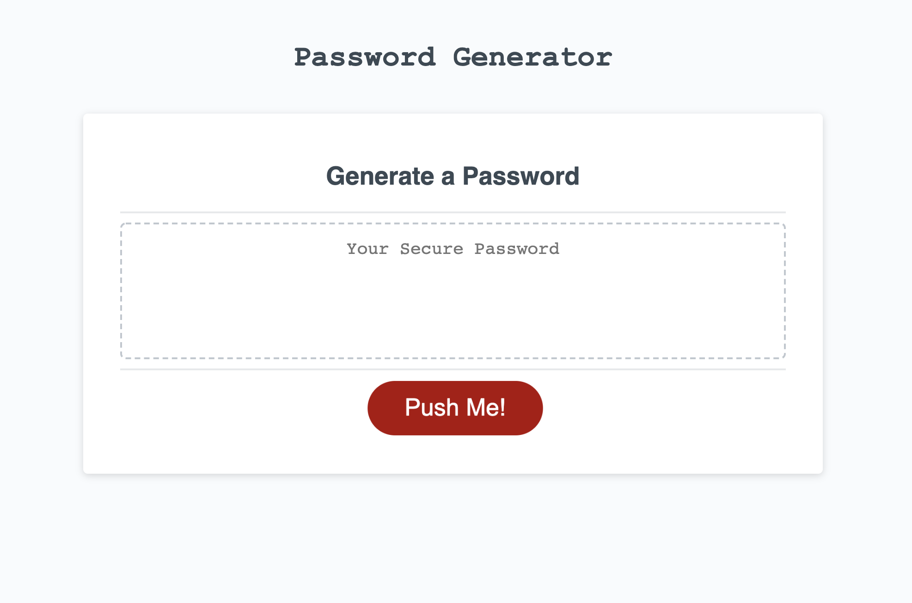

# 3D PUSH Password Generator!

## Description

This app allows you to create a random password based on certain criteria that 
the user can choose while the application is running. At first the computer will
ask the user to pick a number that is at least 8 characters and no more than 128 characters.
If by mistake the user types not a number the app is going to alert to pick a number instead.
It's also going to alert the user if the number picked is lower than 8 or higher than 128.
Once the user pick the right number the app is going to ask the user more questions about password
details. First criteria will be if the password will have lowercase. The second question will be about
uppercase then it will ask if the user prefers a number in it and also a special character. 
Once all these criteria are defined the app is going to pick a random password that will include the user
choices and the password it will be display inside the placeholder where it's written "Your secure password".
I had a little bit of fun with CSS after I've finished the Javascript code and I made the red Push Button 3D.
So when a user open the page the Red button has a short 3D animation. I've also centered the "Generate Password" text
and I've replaced the font-family style on "Password Generator" to give a more bulky look.  
 
Enjoy!!!

link => https://dibello80.github.io/3DPushPasswordGenerator/

## ScreenShot of the app!

The following image shows the web application's appearance:

## Credits

© 2020 Angelo Rocky Dibello - Web Developer 
